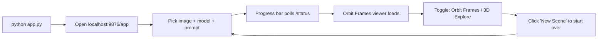

# Full GUI Enhancement Plan

The previous plan already added upload form, model dropdown, progress bar, status polling, orbit viewer, and mode toggle to the frontend. This plan addresses the remaining gaps to make it a fully usable GUI where you just run `python app.py` and open the browser.

## Problem: Frontend Cannot Be Served

The current `frontend/main.js` uses bare ES module imports (`import * as THREE from 'three'`) which require either a bundler or an import map. There is no `package.json` or Vite config. The FastAPI backend only serves `/uploads` static files, not the frontend.

## Solution: Backend Serves Frontend with Import Map

### 1. Add import map to `index.html` so Three.js loads from CDN

Replace the bare `import 'three'` specifiers with an [import map](https://developer.mozilla.org/en-US/docs/Web/HTML/Element/script/type/importmap) pointing to the Three.js CDN (esm.sh or unpkg). This removes the need for any build step or npm.

In [frontend/index.html](frontend/index.html), add before the module script:

```html
<script type="importmap">
{
  "imports": {
    "three": "https://unpkg.com/three@0.170.0/build/three.module.js",
    "three/addons/": "https://unpkg.com/three@0.170.0/examples/jsm/"
  }
}
</script>
```

### 2. Mount frontend as static files in FastAPI

In [backend/app.py](backend/app.py), add a static file mount for the frontend directory and a root HTML route:

```python
from fastapi.responses import FileResponse

app.mount("/uploads", StaticFiles(directory="uploads"), name="uploads")
app.mount("/static", StaticFiles(directory="../frontend"), name="frontend")

@app.get("/app")
async def serve_app():
    return FileResponse("../frontend/index.html")
```

The `main.js` script tag in `index.html` would reference `/static/main.js`.

### 3. Add prompt text input to the GUI

In [frontend/index.html](frontend/index.html), add a text input for the optional prompt (used by ViewCrafter and PanoDreamer). The form row goes below the model selector:

```html
<div class="form-row" id="prompt-row">
  <label for="prompt-input">Prompt:</label>
  <input type="text" id="prompt-input" placeholder="e.g. Rotating view of a building">
</div>
```

In [frontend/main.js](frontend/main.js), include it in the FormData:

```js
const prompt = document.getElementById('prompt-input').value;
if (prompt) formData.append('prompt', prompt);
```

Show/hide the prompt row based on model selection (only relevant for `viewcrafter` and `panodreamer`).

### 4. Add model descriptions as tooltips/subtitles

Enhance the model dropdown in [frontend/index.html](frontend/index.html) with descriptive text so users know what each model does:

```html
<option value="svd">SVD -- Video Diffusion (fast, general)</option>
<option value="viewcrafter">ViewCrafter -- Point Cloud Guided (text prompt)</option>
<option value="seva">SEVA -- Stable Virtual Camera (orbit, best quality)</option>
...
```

### 5. Add "New Scene" button to go back after viewing

After results load, show a "New Scene" button in the mode bar that resets the UI back to the upload form. In [frontend/main.js](frontend/main.js), add a `resetToUpload()` function that:
- Hides orbit viewer and mode bar
- Clears the Three.js scene of loaded models
- Shows the blocker/upload panel again
- Resets progress bar and button states

### 6. Fix the `/app` script src path

Since the frontend files will be served under `/static/`, the `<script>` tag in `index.html` needs to reference `/static/main.js` instead of `/main.js`.

## Files to Change

- [frontend/index.html](frontend/index.html) -- import map, prompt input, model descriptions, script src fix
- [frontend/main.js](frontend/main.js) -- prompt in FormData, show/hide prompt row, "New Scene" reset logic
- [backend/app.py](backend/app.py) -- mount frontend static files, add `/app` HTML route

## Summary of User Flow After Changes


