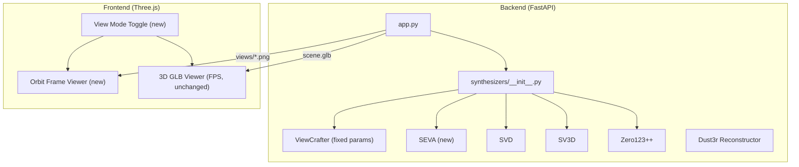

# Three-Task Enhancement Plan

## Task 1: ViewCrafter Black Spots Diagnosis and Fix

### Root Cause

The black spots in ViewCrafter generations come from **missing/occluded regions in the rendered point cloud** that is used as the diffusion conditioning input. ViewCrafter works in two stages:

1. DUSt3R builds a point cloud from the input image
2. The point cloud is rendered from novel camera angles as a conditioning signal for the video diffusion model

When rendered from a new viewpoint, regions that were **occluded or missing** in the original point cloud appear as black holes. The diffusion model is supposed to inpaint these, but with certain parameter settings it fails to fully cover them. This is a **known behavior** documented in the ViewCrafter paper and [GitHub issue #51](https://github.com/Drexubery/ViewCrafter/issues/51).

### Current Configuration in [viewcrafter_synthesizer.py](backend/synthesizers/viewcrafter_synthesizer.py)

The relevant parameters in `_build_opts()` (lines 61-127):

- `mask_pc=True` -- masks out low-confidence point cloud regions
- `bg_trd=0.0` -- background threshold (0.0 means no background removal)
- `dpt_trd=1.0` -- depth threshold for filtering
- `d_phi=30.0` -- camera orbit angle (30 degrees is aggressive)
- `ddim_steps=15` -- diffusion denoising steps (low for speed, but may underperform on inpainting)

### Proposed Fixes

- **Increase `ddim_steps`** from 15 to 25-30: gives the diffusion model more steps to properly inpaint masked/occluded regions
- **Increase `bg_trd`** from 0.0 to 0.2: filters out noisy background points that produce scattered black artifacts
- **Reduce `d_phi`** default from 30.0 to 15.0-20.0: less aggressive camera motion reduces the amount of unseen area that must be hallucinated
- **Set `dpt_trd`** to 0.6-0.8: filters out low-quality depth points more aggressively, reducing hole artifacts

### Files to Change

- [backend/synthesizers/viewcrafter_synthesizer.py](backend/synthesizers/viewcrafter_synthesizer.py): update default parameters in `_build_opts()` and `generate_views()`

---

## Task 2: Add Stable Virtual Camera (SEVA) as a Synthesizer

### Overview

[Stable Virtual Camera (SEVA)](https://github.com/Stability-AI/stable-virtual-camera) is a 1.3B-parameter diffusion model for novel view synthesis. It supports single-image trajectory generation (`img2trajvid_s-prob` task) with preset camera trajectories (orbit, spiral, lemniscate, zoom-out, dolly zoom-out).

### Integration Approach

Follow the same pattern as existing synthesizers (SV3D, Zero123++): create a `SevaSynthesizer` class that subclasses `BaseSynthesizer`.

**Key SEVA API calls** (from `demo.py`):

```python
from seva.model import SGMWrapper
from seva.modules.autoencoder import AutoEncoder
from seva.modules.conditioner import CLIPConditioner
from seva.sampling import DiscreteDenoiser
from seva.utils import load_model
from seva.geometry import get_preset_pose_fov, get_default_intrinsics
from seva.eval import run_one_scene, infer_prior_stats

# Load model
model = SGMWrapper(load_model(model_version=1.1, device="cpu").eval()).to("cuda")
ae = AutoEncoder(chunk_size=1).to("cuda")
conditioner = CLIPConditioner().to("cuda")
denoiser = DiscreteDenoiser(num_idx=1000, device="cuda")

# For single-image orbit:
# task = "img2trajvid_s-prob", traj_prior = "orbit"
```

### Requirements

- Clone `stable-virtual-camera` repo into `backend/vendor/stable-virtual-camera/`
- HuggingFace authentication for model weights (~5GB, auto-downloads on first use)
- Python >= 3.10, torch >= 2.6.0
- Note: flash attention not supported on native Windows -- WSL required

### Files to Create/Change

- **Create** [backend/synthesizers/seva_synthesizer.py](backend/synthesizers/seva_synthesizer.py): new `SevaSynthesizer` class
  - `load_model()`: load SGMWrapper, AutoEncoder, CLIPConditioner, DiscreteDenoiser
  - `generate_views()`: use `img2trajvid_s-prob` task with `orbit` trajectory (default), generate N frames at 576x576, save as PNGs
  - `unload_model()`: release GPU memory
- **Edit** [backend/synthesizers/__init__.py](backend/synthesizers/__init__.py): add `"seva"` to `_REGISTRY`
- **Edit** [backend/app.py](backend/app.py): add `"seva"` to the VRAM offload list in `run_scene_pipeline()`, update docstrings

---

## Task 3: Interactive Orbit Viewer (Mouse Look-Around)

### What SEVA's Website Does

The SEVA website displays pre-rendered orbit/trajectory videos and lets users scrub through frames by dragging the mouse. This creates the illusion of "looking around" the object. The key insight: it is **not** real-time 3D rendering -- it maps mouse position to video frame index along the pre-computed trajectory.

### Proposed Implementation

Add an **orbit frame viewer mode** as a new view mode alongside the existing FPS-style 3D point cloud viewer.

**Orbit Frame Viewer (new -- like SEVA website):**
- Display generated `views/view_*.png` images
- Map horizontal mouse drag position to frame index (0 to N-1)
- Smooth interpolation between frames as user drags
- Works with any synthesizer's output (SVD, ViewCrafter, SEVA, SV3D, etc.)

**Existing 3D Point Cloud Viewer (unchanged):**
- Keep the current `PointerLockControls` (WASD + mouse) FPS-style GLB viewer exactly as-is
- This remains the "3D Explore" mode for navigating the DUSt3R point cloud

### Frontend Changes

The frontend will be enhanced with:
1. A **view mode toggle**: "Orbit Frames" vs "3D Explore"
2. **Orbit Frames mode**: loads all `view_*.png` images, maps mouse X drag position to frame index, renders the appropriate frame on a canvas
3. **3D Explore mode**: existing FPS-style GLB viewer with `PointerLockControls`, unchanged

### Integration with Pipeline

- After `POST /process` completes, the frontend needs to know the session ID and fetch generated views
- Add a new endpoint `GET /views/{session_id}` that returns the list of view image URLs
- The orbit viewer loads these images and enables mouse-drag frame scrubbing

### Files to Create/Change

- **Edit** [frontend/main.js](frontend/main.js): add orbit frame viewer logic and view mode toggle (keep existing PointerLockControls 3D viewer untouched)
- **Edit** [frontend/index.html](frontend/index.html): add UI elements for mode toggle, session input, image upload form wired to `/process`
- **Edit** [backend/app.py](backend/app.py): add `GET /views/{session_id}` endpoint

---

## Architecture Summary



## Important Notes

- SEVA requires WSL on Windows (flash attention limitation). This should be documented in the README.
- SEVA model weights require HuggingFace authentication and are gated behind a model card agreement.
- The ViewCrafter parameter changes are conservative and should improve quality without breaking existing functionality. The values can be exposed as optional API parameters later if needed.
